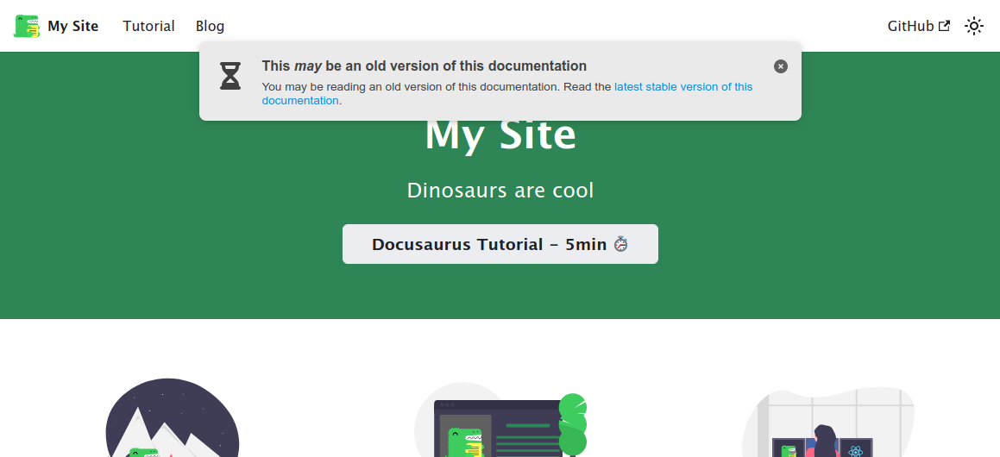
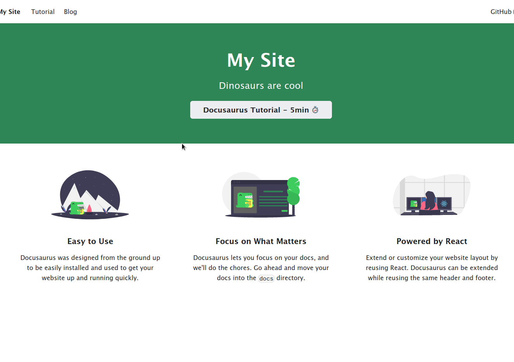

# Empower your docs with Read the Docs

This repository contains a self-contained JavaScript client that will empower your docs,
elevating them to the next level 🚀.
All these features are enabled by default _just_ by hosting your documentation in Read the Docs.

## Features

### Analytics

It uses the [Read the Docs analytics backend](https://docs.readthedocs.io/page/reference/analytics.html) to track page views and searches performed in your documentation.

| Traffic analytics                                                | Search analytics                                                               |
| ---------------------------------------------------------------- | ------------------------------------------------------------------------------ |
|          |                          |
| [Documentation](https://docs.readthedocs.io/page/analytics.html) | [Documentation](https://docs.readthedocs.io/page/guides/search-analytics.html) |

### Docdiff

Shows PR changes embeded on the documentation pages themselves.

### PR warning banner

Shows a banner at the top of the documentation communicating the build was performed from a Pull Request.

### Flyout

_Authentic_ Read the Docs' flyout that shows all the available versions,
links to download the offline formats, view and edit on GitHub and more.

### Non-stable version warning banner

Shows a banner at the top telling readers they may be reading an outdated version.

### Latest version warning banner

Shows a banner at the top telling readers they are reading the latest un-released version of the documentation.

### Search as you type

Super powered search as you type using the [Read the Docs's Server Side Search backend](https://docs.readthedocs.io/page/server-side-search/api.html),
powered by Elasticsearch.

### Sponsorship

[EthicalAds](https://www.ethicalads.io/) to support Read the Docs Community being free for everybody.

### Tooltips

Display a nice tooltip when hovering internal links of the same documentation.

---

## Local Development

- Make sure you have the correct version of Node.js installed (>= 18). You can use [asdf](https://github.com/asdf-vm/asdf) or [nvm](https://github.com/nvm-sh/nvm) for easier management of different Node.js versions.
- Run `npm install` to install dependencies
- Run `npm run dev` to start the local dev server. While this can run without a local Read the Docs development instance, not everything will work.
- Run `npm test` to run the test suite, using web-test-runner. You can run also `npm run test:dev` to leave tests running in watch mode or `npm run test:debug` to manually test the suite in a browser.

---

> **Note**:
> This work is under active development and is still in **alpha**.
